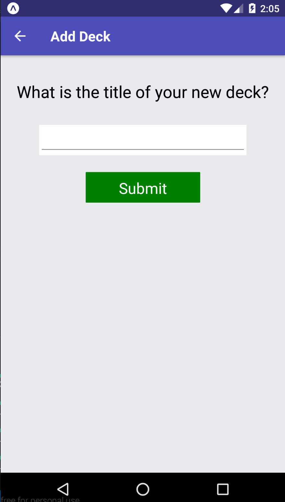

## Screenshots

iOS: 


Android:




## Installation


```
git clone https://github.com/awind/reactnd-flashcards.git
cd reactnd-flashcard
npm install
yarn start
```


## Dependencies

+ [react](https://github.com/facebook/react)
+ [react-native](https://github.com/facebook/react-native)
+ [redux](https://github.com/reactjs/react-redux)